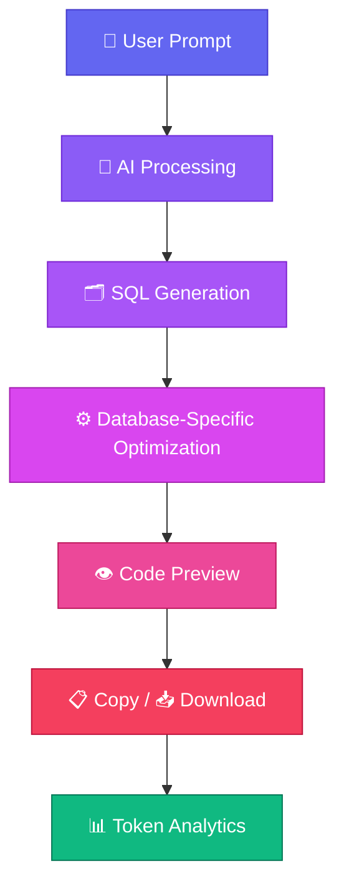

<div align="center">

# 🗄️ DBMS Architect

### Turn plain English into production-ready SQL database schemas — instantly.

Live demo: [https://dbms-architect-ui.vercel.app/](https://dbms-architect-ui.vercel.app/)

DBMS Architect is an AI-powered platform that converts natural language prompts into normalized, production-ready relational database schemas, tailored to your target SQL engine.

<p>
  
  
  
  
  
  
</p>

<p>
  
  
  
  
</p>

<p>
  
  
  
  
</p>

</div>

---

## 📑 Table of Contents

- [Why This Project?](#-why-this-project)
- [Features](#-features)
- [Demo](#-demo--screenshots)
- [Project Workflow](#-project-workflow)
- [Supported Databases](#-supported-databases)
- [Tech Stack](#-tech-stack)
- [Project Structure](#-project-structure)
- [Getting Started](#-getting-started)
- [Usage Example](#-usage-example)
- [Roadmap](#-roadmap)
- [Contributing](#-contributing)
- [License](#-license)
- [Author](#-author)

---

## 💡 Why This Project?

Designing a relational database from scratch is time-consuming — modeling entities, normalizing tables, wiring up foreign keys, and tuning for a specific SQL dialect all add friction before a single line of application code is written.

**DBMS Architect** removes that friction. Describe your application in plain English, and get back a normalized, optimized, dialect-specific SQL schema in seconds.

> [!TIP]
> Whether you're a **student** learning database design, a **backend developer** prototyping fast, a **startup** moving quickly, a **freelancer** juggling client projects, or a **database engineer** validating a design — DBMS Architect cuts schema design time from hours to minutes.

---

## ✨ Features

| Category | Capability |
|---|---|
| 🧠 AI Generation | Natural language → normalized SQL schema |
| 🗃️ Multi-Engine | Supports MySQL, PostgreSQL, Oracle SQL, and Microsoft SQL Server |
| ⚙️ Production-Ready | Generates clean, deployable SQL — not pseudo-code |
| 📥 Export | Download generated schema as a `.sql` file |
| 📋 Quick Copy | One-click copy to clipboard |
| 🔍 Schema Analysis | Review structure before exporting |
| 📊 Token Analytics | Track AI token usage per generation |
| 🎨 Modern UI | Responsive, distraction-free interface |
| ⚡ Fast | Optimized for quick turnaround |
| 🖊️ Clean Editor | Syntax-highlighted SQL preview |

<details>
<summary><strong>📦 What's included in the generated SQL?</strong></summary>

<br>

- `CREATE TABLE` statements
- Primary Keys
- Foreign Keys
- Constraints (`NOT NULL`, `UNIQUE`, `CHECK`, etc.)
- Table relationships (1:1, 1:N, M:N)
- Dialect-accurate data types
- Indexes where appropriate

</details>

---

## 🎬 Demo & Screenshots

### Website Tour


### MySQL Schema Generation Demo


> Demo videos included in this repository:
> - `public/dbms-architect.mp4` — website tour
> - `public/sql-example.mp4` — generated SQL usage example

---

## 🔄 Project Workflow



---

## 🗄️ Supported Databases

| Database | Supported | Optimized Output |
|---|:---:|:---:|
| MySQL | ✅ | ✅ |
| PostgreSQL | ✅ | ✅ |
| Oracle SQL | ✅ | ✅ |
| Microsoft SQL Server | ✅ | ✅ |

---

## 🛠️ Tech Stack

<table>
<tr>
<td valign="top" width="25%">

**Frontend**
- React
- TypeScript
- Tailwind CSS
- Vite

</td>
<td valign="top" width="25%">

**Backend**
- Java
- Spring Boot
- Spring AI

</td>
<td valign="top" width="25%">

**AI**
- LLM-powered SQL generation
- Model: `gpt-5.4-nano`

</td>
<td valign="top" width="25%">

**Database**
- MongoDB Atlas

</td>
</tr>
</table>

**Deployment:** frontend hosted on Vercel, backend hosted on Render, database hosted on MongoDB Atlas

---

## 📁 Project Structure

```
dbms-architect/
├── frontend/               # React + TypeScript + Vite client
│   ├── src/
│   ├── public/
│   └── package.json
├── backend/                 # Java + Spring Boot + Spring AI service
│   ├── src/
│   └── pom.xml
├── docs/
│   └── gifs/                 # Demo GIFs used in this README
│       ├── website-tour.gif
│       └── mysql-generation.gif
└── README.md
```

---

## 🚀 Getting Started

### Prerequisites

Make sure you have the following installed:

- **Node.js** `>= 18.x` and **npm** / **pnpm**
- **Java** `>= 17`
- **Maven** `>= 3.9`
- A running instance of your target database (MySQL / PostgreSQL / Oracle / MSSQL)
- An API key for your LLM provider (for Spring AI)

### Installation

**1. Clone the repository**

```bash
git clone https://github.com/your-username/dbms-architect.git
cd dbms-architect
```

**2. Frontend setup**

```bash
cd frontend
npm install
```

**3. Backend setup**

```bash
cd backend
mvn clean install
```

### Running Locally

<details>
<summary><strong>▶️ Run the backend</strong></summary>

<br>

```bash
cd backend
mvn spring-boot:run
```

Backend will start on `http://localhost:8080` *(default)*.

</details>

<details>
<summary><strong>▶️ Run the frontend</strong></summary>

<br>

```bash
cd frontend
npm run dev
```

Frontend will start on `http://localhost:5173` *(default)*.

</details>

> [!NOTE]
> Configure your database credentials and LLM API key in `backend/src/main/resources/application.properties` (or `.env` for the frontend) before running.
>
> This project is deployed with the frontend on Vercel, backend on Render, and the database on MongoDB Atlas.

---

## 📖 Usage Example

**Input prompt:**

```
Design a hospital management system with patients, doctors, appointments, billing, medicines and staff.
```

**Output:**

- ✅ Fully normalized, optimized SQL schema
- ✅ Foreign key relationships between all entities
- ✅ Constraints applied (`NOT NULL`, `UNIQUE`, `CHECK`)
- ✅ Downloadable `.sql` file ready for deployment

---

## 🗺️ Roadmap

- [ ] Free / Standard / Pro subscription plans
- [ ] Razorpay payment integration
- [ ] User authentication
- [ ] Saved projects
- [ ] Project history
- [ ] Continued AI model improvements
- [ ] Support for additional SQL dialects
- [ ] Visual schema diagrams
- [ ] Export database diagrams (PNG / PDF)
- [ ] Team collaboration features

---

## 🤝 Contributing

Contributions are what make the open-source community such an amazing place to learn, inspire, and create. Any contributions you make are **greatly appreciated**.

1. **Fork** the repository
2. **Create your feature branch**
   ```bash
   git checkout -b feature/amazing-feature
   ```
3. **Commit your changes**
   ```bash
   git commit -m "Add: amazing feature"
   ```
4. **Push to your branch**
   ```bash
   git push origin feature/amazing-feature
   ```
5. **Open a Pull Request**

> [!IMPORTANT]
> Please make sure your code follows existing style conventions and includes relevant tests before submitting a PR. Open an issue first for major changes to discuss what you'd like to change.

---

## 📄 License

This project is licensed under the **MIT License** — see the [LICENSE](LICENSE) file for details.

---

## 👤 Author

<div align="center">

**Your Name**

[](https://github.com/your-username)
[](https://linkedin.com/in/your-profile)
[](https://your-portfolio.com)
[](mailto:your.email@example.com)

</div>

---

<div align="center">

### ⭐ If you find this project useful, consider giving it a star!

*Built with ❤️ to make database design faster and smarter.*

</div>